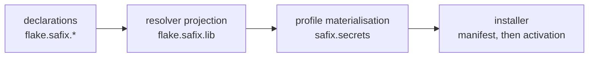

## What this page is for

This page gives you the vocabulary the rest of the documentation uses, and the two
things safix decides for you: which file an entry lands in, and what it reads
from your tree.

## The three questions

Every secret raises three questions, and safix answers them in three different
places.

Who holds it is custody. You declare it, once, at flake level, where every
subject is visible at the same time.

Who else may read it is the audience. You declare that too, as a grant or as a
shared entry, and safix derives the recipient policy and the raw-age recipient
lists from it. There is no second custody registry to keep in step.

Where it lands is placement. A profile answers that, because the path a
decrypted value appears at is a property of the configuration establishing it,
not of the person holding it.

Custody is the same on every host a person logs into. Placement differs per
profile. Keeping the two apart is where safix's refusals come from.

## An audience becomes a file

The audience picks the file. An audience is a sorted list of subject elements,
and its rendering is the directory name, so the path states who can open it.

A single unmarked subject keeps its own directory:
`secrets/safix/users/alice/secrets.yaml`. Anything wider is named for its
elements, joined with `,`, as in `secrets/safix/shared/alice,web/secrets.yaml`.

Markers tell the element kinds apart: `@` a group, `@~` the owner of a machine,
`%` a service, `=` an organization. People and machines carry no marker.

Because the mapping from audience to file is injective, one file never serves two
audiences, and one recipient rule never covers two readerships. The marker
alphabet and the separator are both outside the alphabet a declared name may
use, which is what keeps that true.

A placement is a file plus a key inside it. You never author either. Declaring
`sopsFile` on an entry is refused, and the option exists so the refusal has a
name.

## Entry, catalogue, carries, private

An **entry** is a declared secret. Every entry carries the same fields wherever
it is declared — see
[the declaration reference](../reference/declarations.md).

`flake.safix.catalogue` is the shelf. An entry there states that the thing
exists, not that anybody holds one, so a catalogue entry nobody carries puts
nobody in any audience.

`flake.safix.users.<u>.carries.<name>` takes one off the shelf for a person. By
default each carrier gets their own file with their own value, so two carriers of
one label hold two unrelated values. Setting `shared = true` on the catalogue
entry makes it one value instead, read by every carrier.

`flake.safix.users.<u>.private.<name>` declares an entry that exists only for
that person. The audience is one key, and no other person's declaration can
widen it.

Carrying confers no read of anyone else's copy. Membership of a group confers a
read of the files that group's audience names, and nothing else.

## One entry, one name

A name is the whole handle. The declared name is the key inside the document by
default, the argument a verb takes, and the attribute a profile reads at
`config.safix.secrets.<name>`.

So a name no declaration covers is refused rather than given a destination, and
an `importedSecrets` name that collides with a resolved entry is refused rather
than merged. Two entries resolving onto one path are refused as well, because
whichever activates second would unlink the first's output.

One audience per entry, likewise: an entry that is `shared` and also handed on
through a `sharedWith` grant has two answers to who reads it, and that is
refused.

## The namespace rule

safix reads no option outside its own namespace, and defines none outside it
either.

The consequence is what it does not give you. safix holds no record of your
people, hosts or units, so nothing reconciles your registry with its own, and
nothing adapts another framework's options for you. What you write instead is
one projection, in your own tree, mapping your registry onto
`flake.safix.users`, `flake.safix.machines` and `flake.safix.services`. A module
handed to `mkVault` that declares an option outside safix's namespace is
refused.

The rule cuts the other way too. A tree already running another secrets
framework keeps every option it set there, and safix is unaffected by whichever
revision of it that tree pins.

## From declaration to installed file

Declarations may scatter across your tree, one statement per file, because they
are mergeable attribute sets. safix finds them through the module system and
reads no path, no filename and no directory structure to do it.

The resolver projection at `flake.safix.lib` holds the audiences, the placements,
the generated policy text and the check builders. A profile binds it through
[`safix.flake`](../reference/profile-options.md#safixflake) or
[`safix.lib`](../reference/profile-options.md#safixlib) and selects a person or a
machine.

`safix.secrets` is that resolution, read-only, typed by safix's own entry
submodule. The installer builds its manifest from the same value you read, so
what you read and what is installed cannot disagree.

## Rules stated elsewhere

What changing an audience gives you, and what it does not, is the revocation
rule in [Custody](custody.md).

Where the three storage roots are, and what each one holds, is in
[Storage layout](storage-layout.md).
